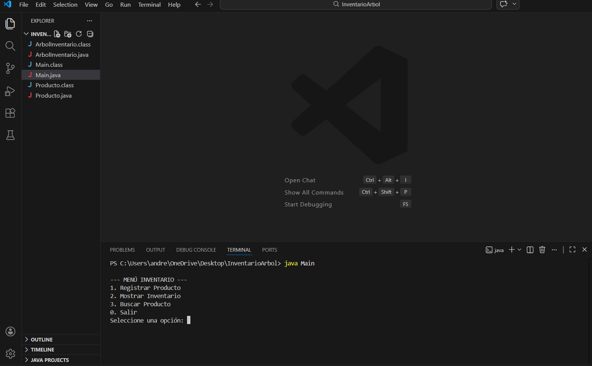
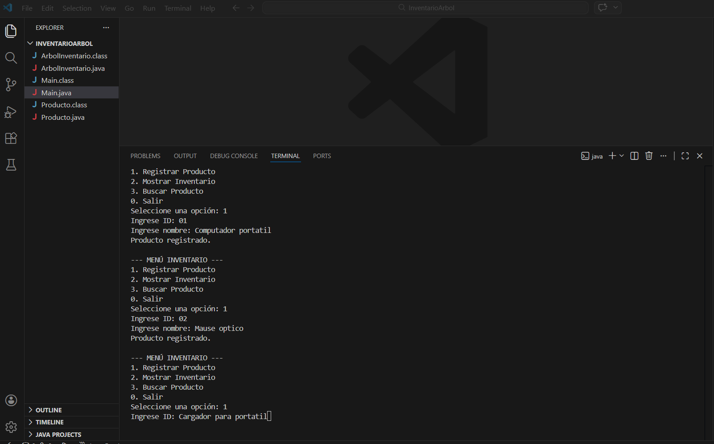
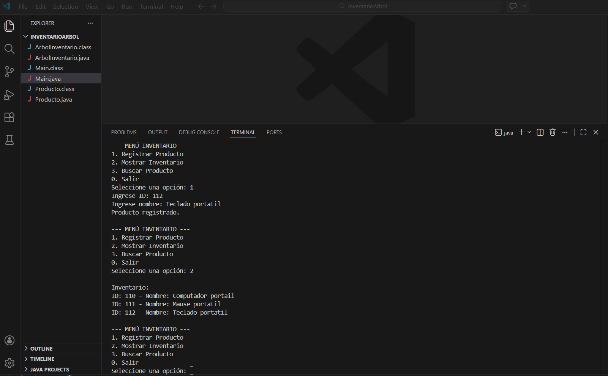
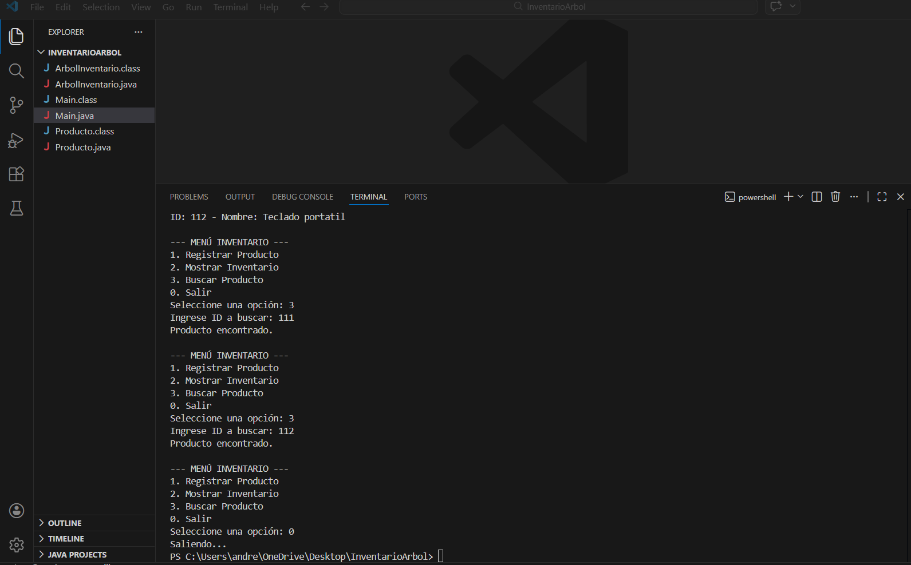
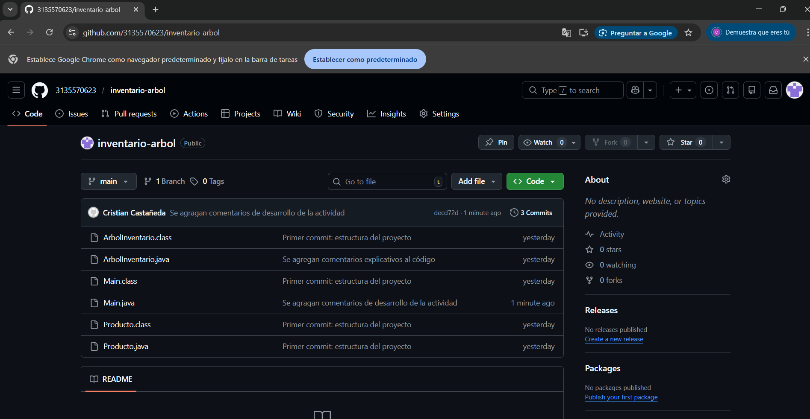

Creacion de un Inventario con Árbol Binario

## Objetivo
Desarrollar una aplicación de consola que permita a los usuarios tener un inventario con la opcion de resgistrar, conocer y eliminar productor del mismo.

## Instrucciones
1. Compilar:
javac Main.java

2. Ejecutar:
java Main

## Funciones
- Registrar productos nuevo a una lista que se denomina inventario
- Mostrar productos que se han ingresado previmante a un nuevo inventario
- Buscar elementos que desean verse

## 🎥 Video
(poner link aquí)
